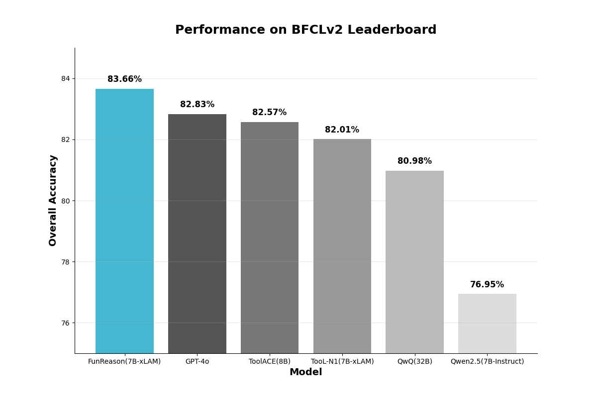
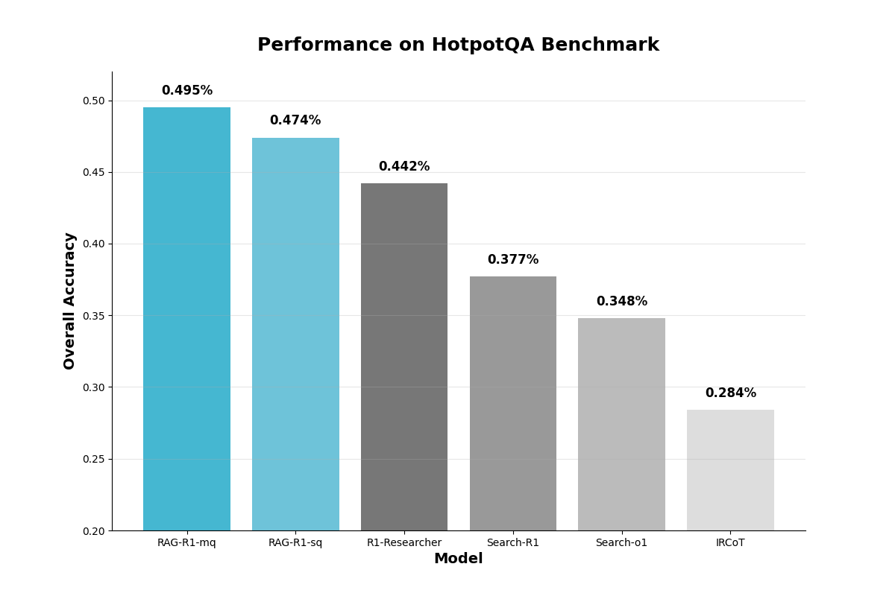

<div align="left">

# AWorld: The Agent Runtime for Self-Improvement

</div>

<h4 align="center">

*"Self-awareness: the hardest problem isn't solving within limits, it's discovering one's own limitations"*

[![Twitter Follow][twitter-image]][twitter-url]
[![WeChat QR Code][wechat-image]][wechat-url]
[![Discord][discord-image]][discord-url]
[![License: MIT][license-image]][license-url]
[![DeepWiki][deepwiki-image]][deepwiki-url]
<!-- [![arXiv][arxiv-image]][arxiv-url] -->

</h4>

<h4 align="center">

[中文版](./elegant_readme_zh.md) |
[Quickstart](#️-quickstart) |
[Architecture](#️-architecture-design-principles) |
[Applications](#-applications)

</h4>

---
**AWorld** is a next-generation framework for agent learning with three key characteristics: 
1. an efficient agent construction methodology that enables meta-learning of system designs, including prompts, workflows, agent memory, tools, and more
2. encapsulation of complex functional modules including communication protocols and state management
3. runtime state management supporting distributed, high-concurrency execution of agent environments

<br>


> **Agentic Achievements Unboxed!**
>
> &nbsp;&nbsp; ⏱️ **AWorld** nails **5 out of 6 [IMO Problems](https://www.imo-official.org/year_info.aspx?year=2025)** with lightning-fast math reasoning  
>
> &nbsp;&nbsp; 🏆 **77.08** average on the **[GAIA Test](https://huggingface.co/spaces/gaia-benchmark/leaderboard)** — 🥇 #1 among all **open-source** frameworks  

<br>
<!-- bar -->

# 🏃‍♀️ Quickstart
## Prerequisites
Python 3.11+
```bash
git clone https://github.com/inclusionAI/AWorld && cd AWorld

python setup.py install
```
## Hello world examples
We introduce the concepts of `Agent` and `Runners` to help you get started quickly.
```python
import os

from aworld.agents.llm_agent import Agent
from aworld.runner import Runners

summarizer = Agent(name="Summary Agent", system_prompt="You specialize at summarizing.")

result = Runners.sync_run(input="Tell me a succint history about the universe", agent=summarizer)
```

Next, we introduce the concepts of `Swarm` to construct a team of agents.
```python
import os

from aworld.agents.llm_agent import Agent
from aworld.runner import Runners
from aworld.core.agent.swarm import Swarm

researcher = Agent(name="Research Agent", system_prompt="You specialize at researching.")
summarizer = Agent(name="Summary Agent", system_prompt="You specialize at summarizing.")
# Create agent team with collaborative workflow
team = Swarm(researcher, summarizer)

result = Runners.sync_run(input="Tell me a complete history about the universe", swarm=team)
```

Finally, run your own agents or teams
```bash
# Set LLM credentials
export LLM_MODEL_NAME="gpt-4"
export LLM_API_KEY="your-api-key-here"
export LLM_BASE_URL="https://api.openai.com/v1"

# Run
python /path/to/agents/or/teams
```

<details>
<summary style="font-size: 1.2em;font-weight: bold;"> 🌏 Click to View Advanced Usages </summary>

### Agent Equipped with MCP Tools
```python
import os

from aworld.agents.llm_agent import Agent
from aworld.runner import Runners

mcp_config = {
    "mcpServers": {
        "GorillaFileSystem": {
            "type": "stdio",
            "command": "python",
            "args": ["examples/BFCL/mcp_tools/gorilla_file_system.py"],
        },
    }
}

file_sys = Agent(
    name="file_sys_agent",
    system_prompt=(
        "You are a helpful agent to use "
        "the standard file system to perform file operations."
    ),
    mcp_servers=mcp_config.get("mcpServers", []).keys(),
    mcp_config=mcp_config,
)

result = Runners.sync_run(
    input=(
        "use mcp tools in the GorillaFileSystem server "
        "to perform file operations: "
        "write the content 'AWorld' into "
        "the hello_world.py file with a new line "
        "and keep the original content of the file. "
        "Make sure the new and old "
        "content are all in the file; "
        "and display the content of the file"
    ),
    agent=file_sys,
)
```

### Agent Integrated with Memory
It is recommended to use `MemoryFactory` to initialize and access Memory instances.

```python
from aworld.memory.main import MemoryFactory
from aworld.core.memory import MemoryConfig, MemoryLLMConfig

# Simple initialization
memory = MemoryFactory.instance()

# Initialization with LLM configuration
MemoryFactory.init(
    config=MemoryConfig(
        provider="aworld",
        llm_config=MemoryLLMConfig(
            provider="openai",
            model_name=os.environ["LLM_MODEL_NAME"],
            api_key=os.environ["LLM_API_KEY"],
            base_url=os.environ["LLM_BASE_URL"]
        )
    )
)
memory = MemoryFactory.instance()
```

`MemoryConfig` allows you to integrate different embedding models and vector databases.
```python
import os

from aworld.core.memory import MemoryConfig, MemoryLLMConfig, EmbeddingsConfig, VectorDBConfig

MemoryFactory.init(
    config=MemoryConfig(
        provider="aworld",
        llm_config=MemoryLLMConfig(
            provider="openai",
            model_name=os.environ["LLM_MODEL_NAME"],
            api_key=os.environ["LLM_API_KEY"],
            base_url=os.environ["LLM_BASE_URL"]
        ),
        embedding_config=EmbeddingsConfig(
            provider="ollama", # or huggingface, openai, etc.
            base_url="http://localhost:11434",
            model_name="nomic-embed-text"
        ),
        vector_store_config=VectorDBConfig(
            provider="chroma",
            config={
                "chroma_data_path": "./chroma_db",
                "collection_name": "aworld",
            }
        )
    )
)
```

### Mutil-Agent Systems
We present two kinds of topologies: `Leader-Executor` and `Fully Meshed`.
```python
"""
Leader-Executor topology:
 ┌───── plan ───┐     
exec1         exec2

Each agent communicates with a single supervisor agent, 
well recognized as Leader-Executor topology, 
also referred to as a team topology in Aworld.
"""
plan = Agent(name="plan", conf=agent_conf)
exec1 = Agent(name="exec1", conf=agent_conf)
exec2 = Agent(name="exec2", conf=agent_conf)
swarm = TeamSwarm(plan, exec1, exec2, build_type=GraphBuildType.TEAM)
```

```python
"""
Fully Meshed topology:
    ┌─────────── A ──────────┐
    B ───────────|────────── C 
    └─────────── D  ─────────┘

Fully meshed topology means that each agent 
can communicate with every other agent, 
any agent can decide which other agent to call next.
"""
A = Agent(name="A", conf=agent_conf)
B = Agent(name="B", conf=agent_conf)
C = Agent(name="C", conf=agent_conf)
D = Agent(name="D", conf=agent_conf)
swarm = MeshSwarm(A, B, C, D)
```

</details>

<br>

# 🔥 News
- 🐱 **[2025/07/25]** AWorld achieves rapid mathematical reasoning! Built a multi-agent system in just hours that solved <span style="color: #d81b60; font-weight: bold;">5/6 IMO 2025 problems</span>. See implementation in [IMO](examples/imo/README.md) section.
- 🦍 **[2025/07/23]** We released the runtime construction tutorial for BFCL benchmark! Learn how to synthesize function call samples in our comprehensive [`tutorial`](examples/BFCL/README.md). 
- 🦤 **[2025/07/07]** AWorld, as a runtime, is now ready for agentic training. See [Self-Improvement section](#self-improvement-with-diverse-runtimes) for details. We have updated our score to <span style="color: #d81b60; font-weight: bold;">77.08</span> on the <u>GAIA test</u>. Learn how to construct a GAIA runtime in the [Demo section](#demo-of-gaia-agent-runtime).
- 🦩 **[2025/06/19]** We have updated our score to <span style="color: #d81b60; font-weight: bold;">72.43</span> on the <u>GAIA test</u>. Additionally, we have introduced a new local running mode. See `./README-local.md` for detailed instructions.
- 🐳 **[2025/05/22]** For quick GAIA evaluation, MCP tools, AWorld, and models are now available in a single Docker image. See <code>./README-docker.md</code> for instructions and [youtube video](https://www.youtube.com/watch?v=kkYWeVvJKrg) for demo.
- 🥳 **[2025/05/13]** AWorld has updated its state management for browser use and enhanced the video processing MCP server, achieving a score of <span style="color: #d81b60; font-weight: bold;">77.58 (Pass@1 = 61.8)</span> on <u>GAIA validation</u>  and maintaining its position as the top-ranked open-source framework. Learn more: [GAIA leaderboard](https://huggingface.co/spaces/gaia-benchmark/leaderboard)
- ✨ **[2025/04/23]** AWorld ranks 3rd on GAIA benchmark (69.7 avg) with impressive Pass@1 = 58.8, 1st among open-source frameworks. Reproduce with <code>python examples/gaia/run.py</code>

<br>

# 🏗️ Architecture Design Principles
AWorld (Agent World) is a versatile multi-agent framework designed to facilitate collaborative interactions and self-improvement among agents. 

It provides a comprehensive environment that supports a diverse array of applications, such as `Product Prototype Verification`, `Foundational Model Training`, and the design of `Multi-Agent Systems (MAS)` through meta-learning. 

This framework is engineered to be highly adaptable, enabling researchers and developers to explore and innovate across multiple domains, thereby advancing the capabilities and applications of multi-agent systems.

## Concepts & Framework


| Concepts | Description |
| :-------------------------------------- | ------------ |
| [`agent`](./aworld/core/agent/base.py)  | Define the foundational classes, descriptions, output parsing, and multi-agent collaboration (swarm) logic for defining, managing, and orchestrating agents in the AWorld system. |
| [`runner`](./aworld/runners)            | Contains runner classes that manage the execution loop for agents in environments, handling episode rollouts and parallel training/evaluation workflows.   |
| [`task`](./aworld/core/task.py)         | Define the base Task class that encapsulates environment objectives, necessary tools, and termination conditions for agent interactions.  |
| [`swarm`](./aworld/core/agent/swarm.py) | Implement the SwarmAgent class managing multi-agent coordination and emergent group behaviors through decentralized policies. |
| [`sandbox`](./aworld/sandbox)           | Provide a controlled runtime with configurable scenarios for rapid prototyping and validation of agent behaviors. |
| [`tools`](./aworld/tools)               | Offer a flexible framework for defining, adapting, and executing tools for agent-environment interaction in the AWorld system. |
| [`context`](./aworld/core/context)      | Feature a comprehensive context management system for AWorld agents, enabling complete state tracking, configuration management, prompt optimization, multi-task state handling, and dynamic prompt templating throughout the agent lifecycle.  |
| [`memory`](./aworld/memory)             | Implement an extensible memory system for agents, supporting short-term and long-term memory, summarization, retrieval, embeddings, and integration.|
| [`trace`](./aworld/trace)               | Feature an observable tracing framework for AWorld, enabling distributed tracing, context propagation, span management, and integration with popular frameworks and protocols to monitor and analyze agent, tool, and task execution.|

> 💡 Check the [examples](./examples/) directory to explore diverse AWorld applications.

### Characteristics
| <div style="width:200px;white-space:nowrap">1. Agent Construction</div> | <div style="width:200px;white-space:nowrap">2. Topology Orchestration</div> | 3. Environment |
|:---------------------|:-------------------------|:----------------|
| ✅ Various model providers <br> ✅ Integrated MCP services <br> ✅ Convient  customizations | ✅ Encapsulated agent runtime <br> ✅ Flexible MAS patterns | ✅ Runtime state management <br> ✅ Clear state tracing <br> ✅ Distributed & high-concurrency environments for training |


## Forward Process Design


<details>
<summary style="font-size: 1.2em;font-weight: bold;"> 🌏 Click to View Tutorial Example</summary>

Here is a forward illustration to collect BFCL forward trajectories: [`tutorial`](./examples/BFCL/README.md).

</details>

## Backward Process Design

> During training, an action-state rollout demonstration using **AWorld's distributed environments**.


> An illustration of training code that seamlessly integrates the RL learning framework (Swift, in this example) with AWorld as the environment is shown below. This integration enables scalable and efficient agent training through distributed environment execution. (To run high-concurrency rollouts, you need to deploy an online distributed environment. Please contact [chenyi.zcy@antgroup.com](mailto:chenyi.zcy@antgroup.com) if assistance is needed.)

<details>
<summary style="font-size: 1.2em;font-weight: bold;"> 🌏 Click to View Tutorial Example</summary>
To apply and use this integration:

1. Clone AWorld's `agent_training_server` branch:
```bash
git clone -b agent_training_server --single-branch https://github.com/inclusionAI/AWorld.git
```

2. Clone ms-swift's v3.5.2 branch (shallow clone):
```bash
git clone -b v3.5.2 --depth=1 https://github.com/modelscope/ms-swift.git ms-swift
```

3. Copy patch files from AWorld to ms-swift:
```bash
cp -r AWorld/patches ms-swift/
```

4. Enter the patches directory and apply the patch:
```bash
cd ms-swift/patches
git apply 0001-feat-add-agent-training-support-with-aworld-server.patch
```
</details>

<br>

# 🧩 Applications
AWorld allows you to construct **agents** and **multi-agent systems** with ease. 

Here are some examples of how you can use AWorld to construct your own applications.

- [✔️] **[IMO MAS](examples/imo/README.md)** - AWorld achieves rapid mathematical reasoning on [IMO](https://www.imo-official.org/year_info.aspx?year=2025) problems, solving <span style="color: #d81b60; font-weight: bold;">5 out of 6</span>  extremely hard question.

- [✔️] **[GAIA Agent](examples/gaia/README.md)** - AWorld is the first open-source framework to achieve <span style="color: #d81b60; font-weight: bold;">77.08</span> on <u>GAIA test</u> and <span style="color: #d81b60; font-weight: bold;">Pass@1 = 61.8</span> on <u>GAIA validation</u>.

- [✔️] **[BFCL Runtime](examples/BFCL/README.md)** - AWorld supports function call data synthesis for [BFCL benchmark](https://gorilla.cs.berkeley.edu/leaderboard.html).

## Self-Improvement & Self-awareness
AWorld aims to reach the limitations of models and continuously push intelligence forward by constructing diverse runtime environments, such as tools, agents, and models, 

The following is a list of successful proposal (with open-source models, technical reports, and code):

| Category | Runtime | <div style="width:400px">Performance</div> | <div style="width:100px;">Key Information</div> |
| --------------- | --------------------------------------- | ---------------------------------------------------------------------------------------- | ---------------------------------- |
| **Tool Use**    | Function call runtime construction [`tutorial`][funreason-model-url] | Competitive on BFCL benchmark  <br>  | ![Dataset][huggingface-dataset-image] <br> [![Model][huggingface-model-image]][funreason-model-url] <br> [![Paper][arxiv-image]][funreason-paper-url] <br> ![Blog][blog-image] <br> [![Code][github-code-image]][funreason-code-url] |
| **Deep Search** | Search runtime to be released           | SOTA on HotpotQA benchmark  <br>     | [![Dataset][huggingface-dataset-image]][deepsearch-dataset-url] <br> [![Model][huggingface-model-image]][deepsearch-model-url] <br> [![Paper][arxiv-image]][deepsearch-paper-url] <br> [![Code][github-code-image]][deepsearch-code-url]      |
| **GAIA Agent** | Fully prepared playground and training pipeline | GAIA Agent Runtime Demo <br>  | Follow the instructions in [GAIA Runtime](./examples/gaia/README.md) |

<br>

# Contributing
We warmly welcome developers to join us in building and improving AWorld! Whether you're interested in enhancing the framework, fixing bugs, or adding new features, your contributions are valuable to us.

For academic citations or wish to contact us, please use the following BibTeX entry:

```bibtex
@software{aworld2025,
  author = {Agent Team at InclusionAI},
  title = {AWorld: Enabling Agent Self-Improvement through Interactive Experience with Dynamic Runtime},
  year = {2025},
  url = {https://github.com/inclusionAI/AWorld},
  version = {0.1.0},
  publisher = {GitHub},
  email = {chenyi.zcy at antgroup.com}
}
```

# Star History


# Appendix: Demo
> Running Pre-defined Agents (e.g., see [demo code](examples/browser_use/run.py)). Below are demonstration videos showcasing AWorld's capabilities across various agent configurations and environments.


<table>
  <tr>
    <th>Mode</th>
    <th>Type</th>
    <th>Demo</th>
  </tr>
  <tr>
    <td rowspan="2">Single Agent</td>
    <td>Browser use</td>
    <td>
      <a href="https://www.youtube.com/watch?v=R7keOLrRDoM" target="_blank">
        
        <br>
        <p align="center">▶️ Watch Browser Demo on YouTube</p>
      </a>
    </td>
  </tr>
  <tr>
    <td>Phone use</td>
    <td>
      <a href="https://www.youtube.com/watch?v=TYh3iqDeIoQ" target="_blank">
        
        <br>
        <p align="center">▶️ Watch Mobile Demo on YouTube</p>
      </a>
    </td>
  </tr>
  <tr>
    <td rowspan="3">Multi Agent</td>
    <td>Cooperative Teams</td>
    <td>
       <a href="https://www.youtube.com/watch?v=sEsgasRrlTs" target="_blank">
        
        <br>
        <p align="center">▶️ Watch Travel Demo on YouTube</p>
      </a>
    </td>
  </tr>
  <tr>
    <td>Competitive Teams</td>
     <td>
       <a href="https://www.youtube.com/watch?v=_CPdhoP4YTg" target="_blank">
        
        <br>
        <p align="center">▶️ Watch Debate Arena on YouTube</p>
      </a>
    </td>
  </tr>
  <tr>
    <td>Mixed of both Teams</td>
    <td align="center"><i>Coming Soon</i> 🚀</td>
  </tr>
</table>

<br>

# Appendix: Web Client Usage
Your project structure should look like this:
```text
agent-project-root-dir/
    agent_deploy/
      my_first_agent/
        __init__.py
        agent.py
```

Create project folders.

```shell
mkdir my-aworld-project && cd my-aworld-project # project-root-dir
mkdir -p agent_deploy/my_first_agent
```

#### Step 1: Define Your Agent

Create your first agnet in `agent_deploy/my_first_agent`:

`__init__.py`: Create empty `__ini__.py` file.

```shell
cd agent_deploy/my_first_agent
touch __init__.py
```

`agent.py`: Define your agent logic:

```python
import logging
import os
from aworld.cmd.data_model import BaseAWorldAgent, ChatCompletionRequest
from aworld.config.conf import AgentConfig, TaskConfig
from aworld.agents.llm_agent import Agent
from aworld.core.task import Task
from aworld.runner import Runners

logger = logging.getLogger(__name__)

class AWorldAgent(BaseAWorldAgent):
    def __init__(self, *args, **kwargs):
        super().__init__(*args, **kwargs)

    def name(self):
        return "My First Agent"

    def description(self):
        return "A helpful assistant that can answer questions and help with tasks"

    async def run(self, prompt: str = None, request: ChatCompletionRequest = None):
        # Load LLM configuration from environment variables
        agent_config = AgentConfig(
            llm_provider=os.getenv("LLM_PROVIDER", "openai"),
            llm_model_name=os.getenv("LLM_MODEL_NAME", "gpt-4"),
            llm_api_key=os.getenv("LLM_API_KEY"),
            llm_base_url=os.getenv("LLM_BASE_URL"),
            llm_temperature=float(os.getenv("LLM_TEMPERATURE", "0.7"))
        )

        # Validate required configuration
        if not agent_config.llm_model_name or not agent_config.llm_api_key:
            raise ValueError("LLM_MODEL_NAME and LLM_API_KEY must be set!")

        # Optional: Configure MCP tools for enhanced capabilities
        mcp_config = {
            "mcpServers": {
                "amap-mcp": {
                    "type": "sse",
                    "url": "https://mcp.example.com/sse?key=YOUR_API_KEY", # Replace Your API Key
                    "timeout": 30,
                    "sse_read_timeout": 300
                }
            }
        }

        # Create the agent instance
        agent = Agent(
            conf=agent_config,
            name="My First Agent",
            system_prompt="""You are a helpful AI assistant. Your goal is to:
            - Answer questions accurately and helpfully
            - Provide clear, step-by-step guidance when needed
            - Be friendly and professional in your responses""",
            mcp_servers=["amap-mcp"],
            mcp_config=mcp_config
        )

        # Extract user input
        user_input = prompt or (request.messages[-1].content if request else "")
        
        # Create and execute task
        task = Task(
            input=user_input,
            agent=agent,
            conf=TaskConfig(max_steps=5),
            session_id=getattr(request, 'session_id', None)
        )

        # Stream the agent's response
        async for output in Runners.streamed_run_task(task).stream_events():
            yield output
```

#### Step 2: Run Agent

Setup environment variables:

```shell
# Navigate back to project root
cd ${agent-project-root-dir}

# Set your LLM credentials
export LLM_MODEL_NAME="gpt-4"
export LLM_API_KEY="your-api-key-here"
export LLM_BASE_URL="https://api.openai.com/v1"  # Optional for OpenAI
```

Launch Your Agent:
```shell
# Option 1: Launch with Web UI
aworld web
# Then open http://localhost:8000 in your browser

# Option 2: Launch REST API (For integrations)
aworld api_server
# Then visit http://localhost:8000/docs for API documentation
```

**Success!** Your agent is now running and ready to chat!


<!-- resource section start -->
<!-- image links -->
[arxiv-image]: https://img.shields.io/badge/Paper-arXiv-B31B1B?style=for-the-badge&logo=arxiv&logoColor=white
[blog-image]: https://img.shields.io/badge/Blog-Coming%20Soon-FF5722?style=for-the-badge&logo=blogger&logoColor=white
[deepwiki-image]: https://img.shields.io/badge/DeepWiki-Explore-blueviolet?logo=wikipedia&logoColor=white
[discord-image]: https://img.shields.io/badge/Discord-Join%20us-blue?logo=discord&logoColor=white
[github-code-image]: https://img.shields.io/badge/Code-GitHub-181717?style=for-the-badge&logo=github&logoColor=white
[huggingface-dataset-image]: https://img.shields.io/badge/Dataset-Coming%20Soon-007ACC?style=for-the-badge&logo=dataset&logoColor=white
[huggingface-model-image]: https://img.shields.io/badge/Model-Hugging%20Face-FF6B6B?style=for-the-badge&logo=huggingface&logoColor=white
[license-image]: https://img.shields.io/badge/License-MIT-yellow.svg
[twitter-image]: https://img.shields.io/twitter/follow/AWorld_AI?style=social
[wechat-image]: https://img.shields.io/badge/WeChat-Add%20us-green?logo=wechat&logoColor=white

<!-- aworld links -->
[deepwiki-url]: https://deepwiki.com/inclusionAI/AWorld
[discord-url]: https://discord.gg/b4Asj2ynMw
[license-url]: https://opensource.org/licenses/MIT
[twitter-url]: https://x.com/InclusionAI666
[wechat-url]: https://raw.githubusercontent.com/inclusionAI/AWorld/main/readme_assets/aworld_wechat.png

<!-- funreason links -->
[funreason-code-url]: https://github.com/BingguangHao/FunReason
[funreason-model-url]: https://huggingface.co/Bingguang/FunReason
[funreason-paper-url]: https://arxiv.org/pdf/2505.20192
<!-- [funreason-dataset-url]: https://github.com/BingguangHao/FunReason -->
<!-- [funreason-blog-url]: https://github.com/BingguangHao/FunReason -->

<!-- deepsearch links -->
[deepsearch-code-url]: https://github.com/inclusionAI/AgenticLearning
[deepsearch-dataset-url]: https://github.com/inclusionAI/AgenticLearning
[deepsearch-model-url]: https://huggingface.co/collections/endertzw/rag-r1-68481d7694b3fca8b809aa29
[deepsearch-paper-url]: https://arxiv.org/abs/2507.02962
<!-- resource section end -->
